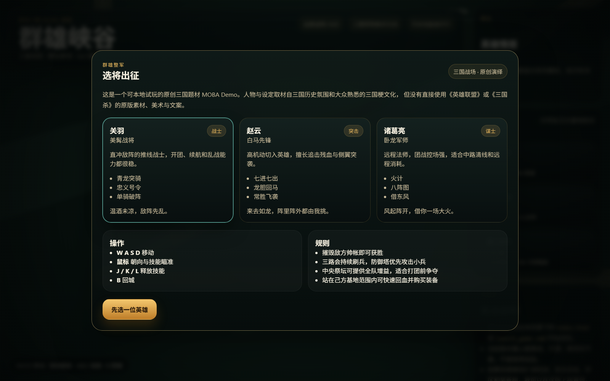
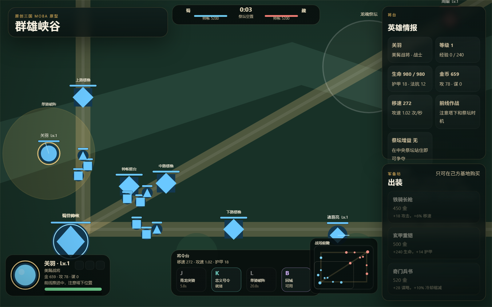

# 群雄峡谷

原创三国题材 3v3 MOBA 原型。  
An original Three Kingdoms-themed 3v3 MOBA prototype built with HTML, CSS, Canvas, and vanilla JavaScript.




## 在线试玩

计划中的公开试玩地址：

`https://yuyangjungle.github.io/three-kingdoms-moba-prototype/`

如果你打开后看到 `404`，通常不是代码问题，而是仓库还没有在 `Settings -> Pages` 中启用 `GitHub Actions` 作为部署来源。

## 项目定位

`群雄峡谷` 目前是一个可公开展示、可本地试玩、可部署到 GitHub Pages 的前端游戏原型。

它已经具备一套完整的 MOBA 核心循环：

- 3v3 单机对战
- 三路兵线与推塔
- 基地胜负条件
- 玩家英雄、敌我 AI 英雄
- 技能、经验、金币、商店与回城
- 中央祭坛争夺
- 实时 HUD、小地图与战场播报

它不是“空壳 demo”，但也还不是商业成品。  
更准确地说，它是一个已经可以对外展示的 playable prototype / vertical slice。

## 公开说明

- 本项目为原创前端原型，使用的是“三国历史氛围 + 原创视觉表达”的方向。
- 项目借鉴的是通用 MOBA 玩法结构，不包含《英雄联盟》或《三国杀》的原版角色立绘、UI、音频、文本或其他受保护素材。
- 当前版本适合作为公开作品集、原型展示页和可试玩项目，不应表述为正式上线商业产品。

## 当前状态

**当前阶段：可玩的公开展示版**

- 适合放在 GitHub 公开展示
- 适合给面试官、同事、朋友或玩家直接试玩
- 适合继续扩展为更完整的玩法验证项目
- 还不建议直接当作商业上线版发布

## 技术栈

- HTML5
- CSS3
- Canvas 2D
- Vanilla JavaScript

## 是否纯前端

**是。当前版本是纯前端项目。**

这意味着：

- 本地直接双击 `index.html` 就能运行
- 部署到 GitHub Pages 即可公开访问
- 当前不需要数据库、服务器或后端接口

## 什么时候才需要后端

只有在你想把它继续做成“更像正式在线游戏”的时候，后端才会变成必需项，比如：

- 用户账号与登录
- 云端存档
- 排行榜
- 战绩系统
- 房间系统 / 匹配系统
- 实时联网对战
- 反作弊与权威同步
- 运营配置、公告、活动与埋点

换句话说：

- **当前展示版 / 作品集版：不需要后端**
- **未来多人在线版：需要后端**

## 本地启动

1. 打开 `index.html`
2. 或双击 `launch_game.cmd`

## 操作方式

- `W A S D`：移动
- `鼠标`：朝向与技能瞄准
- `J / K / L`：释放技能
- `B`：回城

## 适合公开展示的原因

- 一眼能看出题材和玩法方向
- 可以直接试玩，不需要复杂环境
- UI、玩法循环、系统拆分都能体现实现能力
- 对面试官和普通玩家都足够直观

## 适合作为什么类型的作品

- 游戏前端 / H5 游戏 / 原型开发岗位作品
- 客户端交互与玩法实现作品
- 个人作品集中的主讲项目之一
- GitHub 公开展示项目

## 暂时不建议如何描述

不建议把它描述成：

- “正式上线的完整 MOBA 产品”
- “商业可直接运营版本”
- “高完成度联机游戏”

更合适的说法是：

- “可玩的原创三国 MOBA 原型”
- “面向公开展示的前端游戏项目”
- “具备完整核心循环的 vertical slice”

## 后续建议路线

### 第一阶段：继续打磨展示质量

- 增强技能特效和命中反馈
- 加强击杀、受击、升级和推塔播报
- 继续细化地图地表、塔与基地视觉
- 做开局、结算、再来一局流程优化

### 第二阶段：继续扩玩法

- 草丛
- 野区
- 野怪目标点
- 更多英雄
- 更完整的装备树
- 局内数值平衡

### 第三阶段：往正式项目方向扩

- 局域网或联网对战
- 房间系统
- 玩家身份系统
- 排行榜和战绩页
- 后端服务与部署体系

## 部署方式

这个项目最适合部署到 **GitHub Pages**。

原因很简单：

- 当前是纯静态前端
- 不需要服务端渲染
- 不需要接口网关
- 不需要数据库
- 公开展示成本最低

仓库中已经可以配 GitHub Actions 自动部署。  
如果你的仓库启用了 Pages，推送到 `main` 后就可以自动发布。

## 仓库展示建议

建议在 GitHub 仓库右侧 `About` 中补充：

- Description: `Original Three Kingdoms-themed 3v3 MOBA prototype built with HTML5 Canvas and vanilla JavaScript.`
- Website: `https://yuyangjungle.github.io/three-kingdoms-moba-prototype/`
- Topics: `game`, `moba`, `three-kingdoms`, `html5`, `canvas`, `javascript`, `frontend`, `prototype`

## 文件结构

```text
three-kingdoms-moba/
├─ index.html
├─ styles.css
├─ game.js
├─ launch_game.cmd
├─ assets/
│  └─ screenshots/
├─ .github/
│  └─ workflows/
└─ README.md
```

## 面向面试官时可以重点讲什么

- 如何从零搭出一套 MOBA 核心循环
- 如何拆分英雄、兵线、防御塔、投射物和区域技能系统
- 如何在纯前端里实现实时战斗与 HUD
- 如何处理题材表达与版权边界
- 如何把“原型”打磨成可公开展示的作品

## 结论

这个项目：

- **现在可以公开展示**
- **现在可以部署到 GitHub Pages**
- **现在不需要后端**
- **现在仍然属于高质量原型，而不是商业成品**

如果继续迭代，它完全可以进一步升级成更强的作品集项目，甚至演化成真正可持续开发的小型游戏项目。
